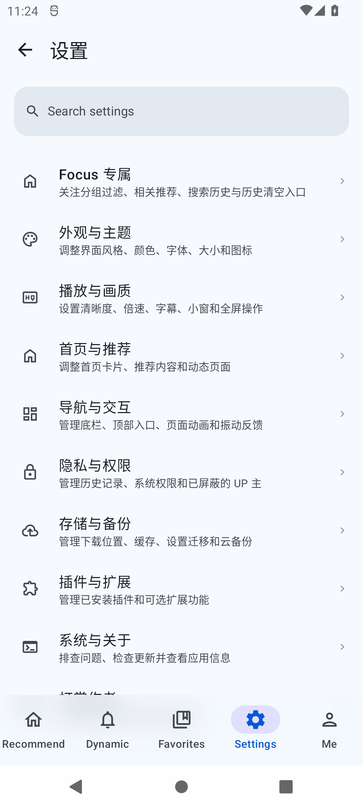
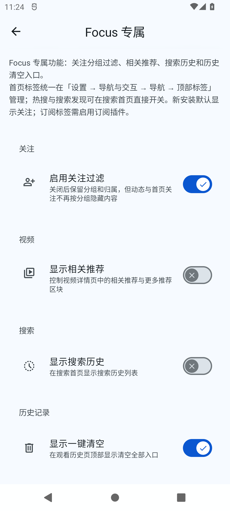
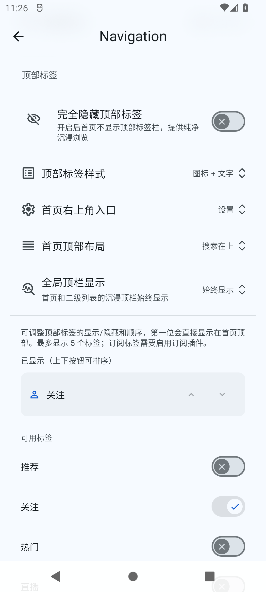
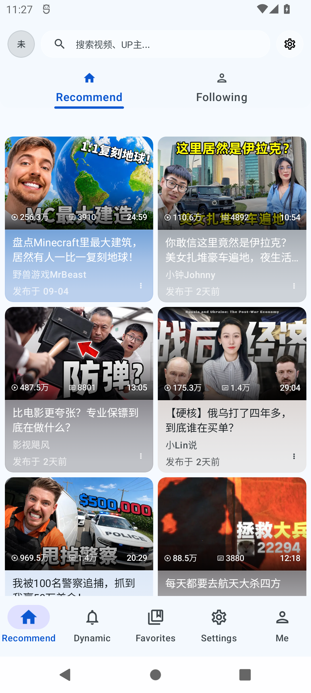

<div align="center">
<h1>BiliPai Focus</h1>
<p>An Android client fork for browsing and watching Bilibili, preserving upstream features while keeping Focus controls clear and independent</p>
<p><a href="README.md">简体中文</a> · <a href="https://github.com/AIALRA-0/BiliPai_Focus/releases/latest">Latest Focus release</a> · <a href="CHANGELOG.md">Changelog</a> · <a href="https://github.com/jay3-yy/BiliPai">Upstream BiliPai</a></p>
<p>Current stable-channel release: <code>0.2.3-alpha.2.focus.1</code> / versionCode <code>389</code> · Upstream base: <code>0.2.3-alpha.2</code> (alpha) · <a href="https://github.com/AIALRA-0/BiliPai_Focus/releases/tag/v0.2.3-alpha.2.focus.1">Release and verification assets</a></p>
</div>

## 1 Project overview

BiliPai Focus is an independently maintained third-party Android client based on the [BiliPai upstream project](https://github.com/jay3-yy/BiliPai). It is not affiliated with or endorsed by Bilibili.

The Focus version follows an upstream version as its baseline and adds an independently increasing Focus revision. The source build version can differ from the latest published release; check [`app/build.gradle.kts`](app/build.gradle.kts) and [Focus Releases](https://github.com/AIALRA-0/BiliPai_Focus/releases) respectively.

## 2 App screens

The following screens were captured from the Focus Dev build in an Android 31 emulator. The recommendation screen shows public content loaded at capture time.

<div align="center">


<p><em>Figure 2.1. Settings home at its current scroll position, with the settings search field and category entries visible.</em></p>
</div>

## 3 Download and installation

The Focus package requires Android 8.0 or later and currently targets 64-bit ARM devices. Android 12 or later provides a more complete dynamic theming experience. Standard video can offer 4K, 1080P60, or HDR quality tiers; available options depend on account access, the video source, and device capabilities.

### 3.1 Install

Step 1: Open [Focus Releases](https://github.com/AIALRA-0/BiliPai_Focus/releases/latest) and read the release notes.

Step 2: Download the latest Focus package.

Step 3: Open the package on your Android device. The system may ask you to allow installations from the selected source.

Step 4: Open the app and browse public content. Sign in to use features that require account access.

The current sign-in page lists the methods available in this build. Options may include:

- TV QR sign-in
- Phone and password
- SMS verification
- Cookie import

The [user FAQ](docs/wiki/FAQ.md) covers account and network questions. Download this project's package only from Focus Releases, and follow Bilibili's platform rules and the rights holders' requirements.

## 4 Focus-specific settings

The settings home provides a **Focus-specific settings** entry. Searching for “Focus” in settings also opens it. The Focus page is reserved for behavior unique to this fork.

- Upstream navigation settings are the single source for top-tab visibility and ordering; Focus no longer provides duplicate switches
- During an upgrade, Focus combines the two legacy tab settings into the set of tabs users actually saw, preserves their order, and migrates the result to the upstream setting
- A fresh install shows “Following” by default. “Subscriptions” appears when the subscriptions plugin is enabled; other upstream-supported tabs can be enabled and ordered in navigation settings
- Focus keeps settings for followed-account filtering, related videos, search history, and the clear-history action

<div align="center">


<p><em>Figure 4.1. Focus-specific settings for followed-account filtering, related videos, search history, and clearing history.</em></p>
</div>

The top-tab settings list only includes upstream-configurable entries. A tab's availability may also depend on navigation configuration, available content, or an entry provided by a plugin. See the [user FAQ](docs/wiki/FAQ.md) for troubleshooting.

<div align="center">


<p><em>Figure 4.2. Upstream navigation settings for top-tab visibility and ordering; the shown switch states are specific to this emulator.</em></p>
</div>

## 5 Upstream capabilities

Focus continues the upstream app's common user flows. Account permissions, the content itself, and device capabilities can limit individual features.

- **Video playback** covers quality, danmaku, and player controls
- **Anime and live streams** cover episodes, playback progress, categories, and live rooms
- **Content and community** include recommendations, search, activity feeds, and messages
- **Offline and casting** include downloads, local playback, and device casting
- **Backup and restore** support WebDAV
- **Large screens and appearance** adapt to tablets, foldables, and multiple themes
- **Notes and recommendations** include video notes, AI-summary drafts, and Today Watch

<div align="center">


<p><em>Figure 5.1. Example after enabling Recommend in navigation settings, with Recommend and Following tabs and public content loaded at capture time. Recommendations change over time.</em></p>
</div>

See the [feature matrix](docs/wiki/FEATURE_MATRIX.md) for capabilities, status, and current limits. AI-summary drafts depend on configured services. See the [roadmap](docs/wiki/ROADMAP.md) for planned work.

## 6 Plugins and extensions

- The app includes 10 built-in plugins; names and status are in the [feature matrix](docs/wiki/FEATURE_MATRIX.md)
- JSON rule plugins can be imported by URL and filter recommendations or danmaku; format details are in the [plugin development guide](docs/PLUGIN_DEVELOPMENT.md)
- External `.bpskin` skin packages preview limited interface resources; see the [skin sample](plugins/samples/winter-cloud-skin/README.md)
- External `.bpplugin` Kotlin packages are parsed and checked to display their capability requests; the host does not run their code. See the [Plugin SDK guide](plugins/sdk/README.md)
- Source-level native plugins require code changes and a new build; see the [native plugin guide](docs/NATIVE_PLUGIN_DEVELOPMENT.md)

Review the source and rules before importing third-party JSON plugins. Capability declarations for external packages are described in the [Plugin SDK guide](plugins/sdk/README.md).

First Visit Recommendation adapts work by wangdaodao's [TabulaBili](https://github.com/wangdaodaodao/TabulaBili) and tjsky's [TabulaBili-Plus](https://github.com/tjsky/TabulaBili). This credit does not imply an affiliation with those authors.

## 7 Build and development

The project uses the Gradle Wrapper included in the repository and JDK 21. Android Studio and the Android SDK must support the Gradle plugin and SDK versions declared by the repository; exact dependency versions are in [`gradle/libs.versions.toml`](gradle/libs.versions.toml) and the build scripts.

```bash
git clone https://github.com/AIALRA-0/BiliPai_Focus.git
cd BiliPai_Focus
./gradlew :app:compileDebugKotlin
```

This command compiles the app's Kotlin code and does not produce an installable package. To create a local installable package, maintainers can use `./gradlew :app:assembleDev`; its signing and installation behavior differ from an official Focus Release. Release builds require the Focus signing configuration held by the maintainers; the upstream signing key cannot replace it. See the [release workflow](docs/wiki/RELEASE_WORKFLOW.md).

When `app/google-services.json` is present, the build enables Firebase Crashlytics and usage analytics. The app has separate controls for these features, and both default to enabled in the source. Review the settings and [privacy FAQ](docs/wiki/FAQ.md) before use. Do not commit private configuration files.

Main modules:

- `app/`: Android app
- `design-system/`: shared UI system
- `settings-core/`: settings policies
- `network-core/`: network policies
- `plugin-sdk/`: plugin interfaces
- `plugins/`: plugin examples and extensions
- `baselineprofile/`: performance profiles
- `docs/`: project documentation and verification records
- `scripts/`: maintenance tools

## 8 Verification status

The previous full-device run had 16 failures and 3 skips out of 63 checks. Itemized results are in the [September 23 verification report](docs/audits/2026-09-23-alpha2-verification.md).

Fifteen targeted unit-test classes passed. Targeted API 31 emulator checks also covered an upgrade from the previous build, top-tab settings, restored dynamic-feed content, and playback resuming after a seek. Device details, steps, and limits are in the [September 24 iteration report](docs/audits/2026-09-24-focus-alpha2-iteration.md).

Focus `v0.2.3-alpha.2.focus.1` is published on the stable channel. Tag CI completed signing-continuity checks and uploaded the APK, checksums, metadata, and build-attestation assets; an API 31 emulator verified the previous client discovering the update, downloading it, installing through Android, launching it, and retaining user data. The attestation digest was checked; its workflow source commit differs from the release tag, so strict tag-reference verification is limited as documented in the [iteration report](docs/audits/2026-09-24-focus-alpha2-iteration.md).

The previous full-device result remains 16 failures and 3 skips out of 63 checks; the suite is not all green. Minimum API 26 ARM64, a real foldable hinge/posture device, and complete automated home accessibility-node coverage still lack device evidence. These limits are recorded rather than reported as passed.

## 9 Documentation, support, and license

- [Wiki home](docs/wiki/README.md): project documentation index
- [Architecture](docs/wiki/ARCHITECTURE.md): modules and app architecture
- [Feature matrix](docs/wiki/FEATURE_MATRIX.md): feature status and limits
- [QA guide](docs/wiki/QA.md): verification steps
- [Plugin guides](docs/PLUGIN_DEVELOPMENT.md) and [native plugin guide](docs/NATIVE_PLUGIN_DEVELOPMENT.md): plugin development documentation
- [Versioning](docs/wiki/VERSIONING.md), [release workflow](docs/wiki/RELEASE_WORKFLOW.md), and [changelog](CHANGELOG.md): version and release documentation
- [Code structure guide](STRUCTURE_GUIDELINES.adoc): collaboration and repository structure
- [AI / LLM documentation entry](llms.txt) and [navigation guide](docs/wiki/AI.md): entry points for automated tools reading this project
- [Focus issue tracker](https://github.com/AIALRA-0/BiliPai_Focus/issues): report Focus-specific issues
- [BiliPai Issues](https://github.com/jay3-yy/BiliPai/issues): report upstream issues
- [Upstream Telegram channel](https://t.me/bilipai666): BiliPai upstream project announcements
- [Upstream Telegram group](https://t.me/bilipai888/1): community discussion for the upstream project
- [Upstream X account](https://x.com/YangY_0x00): public updates from the upstream maintainer
- [Focus pull requests](https://github.com/AIALRA-0/BiliPai_Focus/pulls)
  - Fork the repository and create a `feature/*` or `fix/*` branch
  - Keep changes focused and include relevant tests or documentation
  - Describe the goal, impact, and verification in the pull request

The repository's [`LICENSE`](LICENSE) contains the GNU General Public License v3.0 text. The upstream README also has a non-commercial use statement; the two descriptions differ, and this page does not replace maintainer confirmation of how they apply. Third-party assets and services remain subject to their own licenses and platform rules.

Crash reports and usage analytics are available only in builds that include Firebase configuration. Playback, search, sign-in, updates, and plugin imports require network access. Do not publish cookies, tokens, passwords, account QR codes, or unredacted logs in issue reports.

## 10 Acknowledgements

Focus inherits and continues to sync code and project documentation from [BiliPai](https://github.com/jay3-yy/BiliPai). The project also uses or references these open-source projects and materials:

- [Jetpack Compose](https://developer.android.com/jetpack/compose): declarative UI toolkit
- [BiliPai-miuix](https://github.com/Piracola/BiliPai-miuix): upstream UI component facade and design-system refactoring contribution (@piracola)
- [Miuix](https://github.com/compose-miuix-ui/miuix): Android UI components
- [AndroidX Media](https://github.com/androidx/media): video and audio playback
- [DanmakuRenderEngine](https://github.com/bytedance/DanmakuRenderEngine): danmaku rendering
- [BilibiliSponsorBlock](https://github.com/hanydd/BilibiliSponsorBlock): sponsor-segment data
- [Retrofit](https://github.com/square/retrofit): network requests
- [OkHttp](https://github.com/square/okhttp): HTTP client
- [Room](https://developer.android.com/training/data-storage/room): local database
- [DataStore](https://developer.android.com/topic/libraries/architecture/datastore): local preference storage
- [Coil](https://github.com/coil-kt/coil): image loading
- [Lottie](https://github.com/airbnb/lottie-android): animation
- [Haze](https://github.com/chrisbanes/haze): interface blur effects
- [Compose Cupertino](https://github.com/alexzhirkevich/compose-cupertino): iOS-style UI components
- [bilibili-API-collect](https://github.com/SocialSisterYi/bilibili-API-collect): public API documentation
- [PiliPlus](https://github.com/bggRGjQaUbCoE/PiliPlus): mobile implementation reference
- [Bili Pilot](https://github.com/siwei-yuan/bili-pilot): mobile implementation reference

Bili Pilot's signed-CDN, segment-routing, and prefetch designs are references only. Focus has an independent Kotlin implementation and does not copy its JavaScript code.

See the Gradle version catalog for dependency versions. Each dependency remains subject to its own license.
