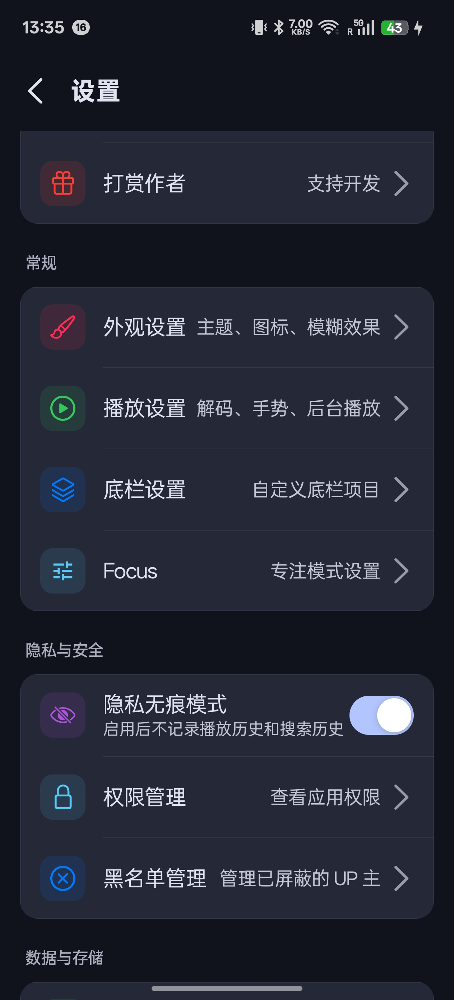
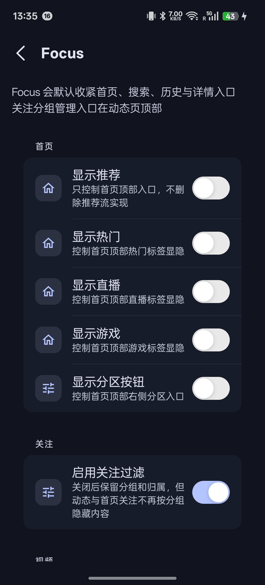
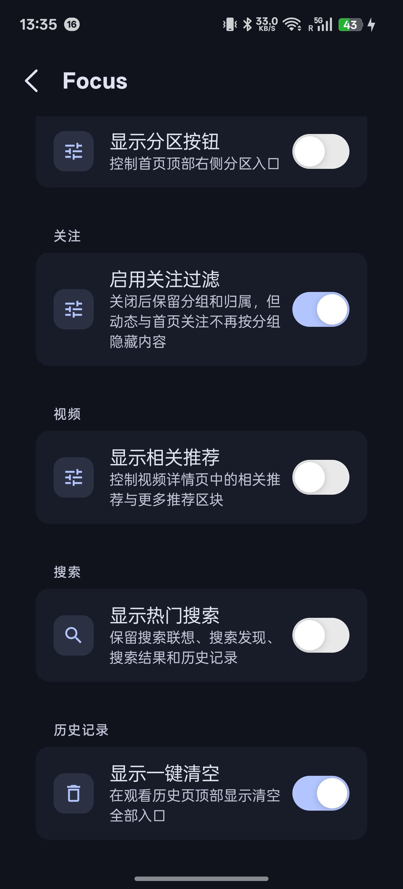
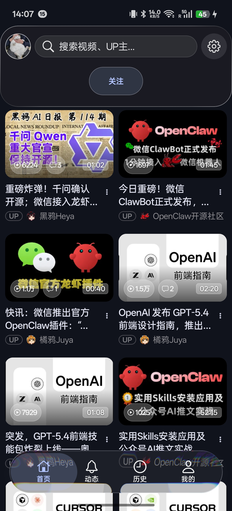
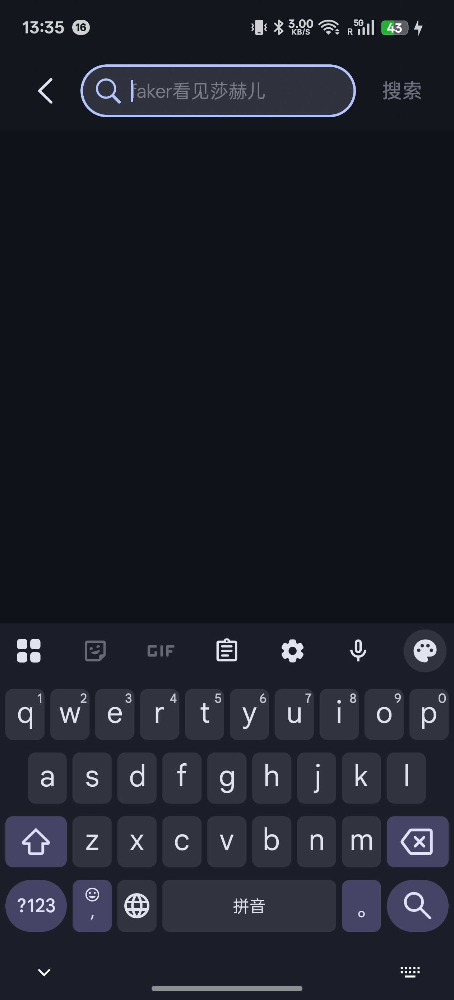
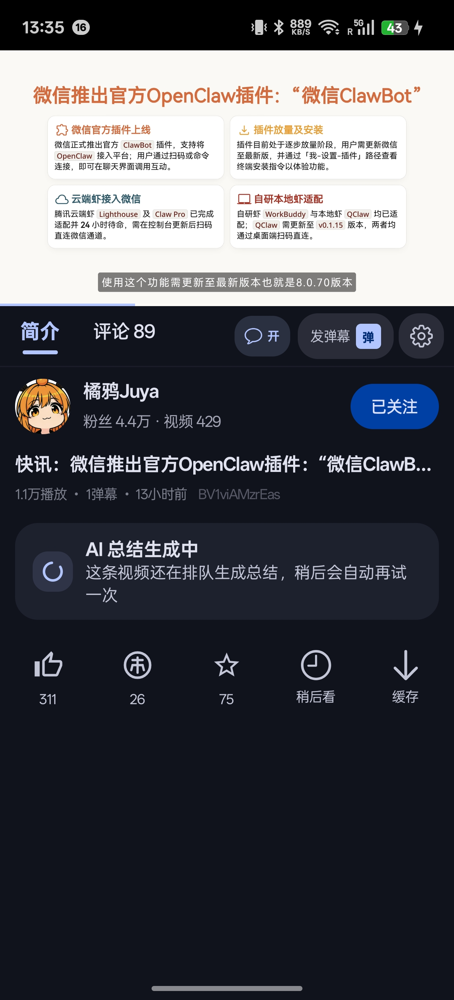
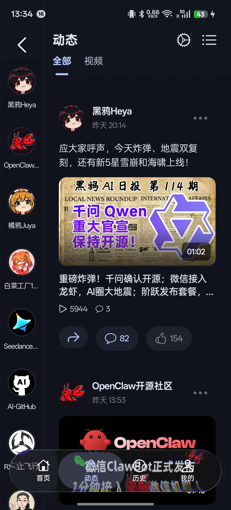
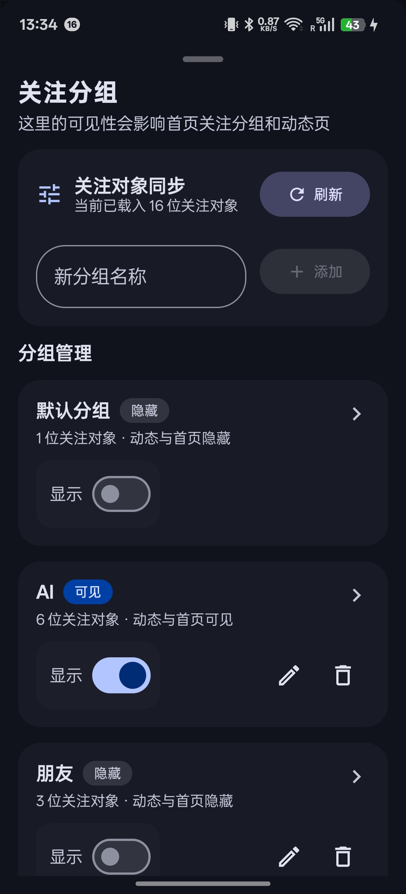
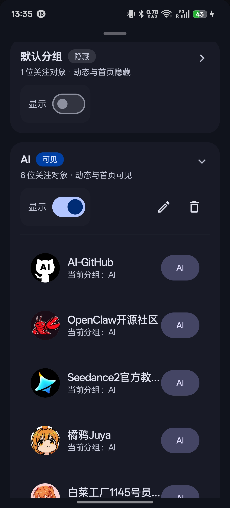
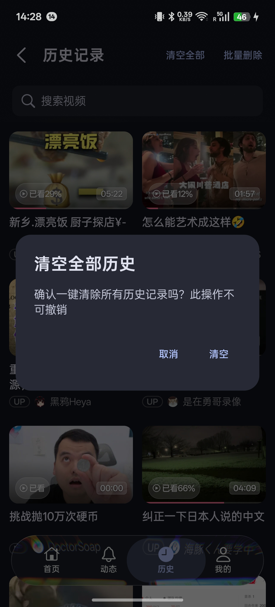

# BiliPai Focus 

<p align="center">
  <strong>Native, Pure, Extensible — a Focus-tailored fork built on top of BiliPai</strong>
</p>

<p align="center">
  <sub>Last updated: 2026-03-24 · Upstream base v7.1.2 · Current Focus release v7.1.2-focus.4</sub>
</p>

<p align="center">
  
  
  
  
  
</p>

<p align="center">
  
  
  
  
</p>

<p align="center">
  <a href="https://t.me/BiliPai"></a>
  <a href="https://x.com/YangY_0x00"></a>
</p>

## 🚀 Quick Links

| Category | Entry |
| --- | --- |
| Get Started | [Official Releases](https://github.com/jay3-yy/BiliPai/releases) · [Focus Releases](https://github.com/AIALRA-0/BiliPai_Focus/releases) · [Focus Release Notes](docs/releases/focus-7.1.2-focus.4-en.md) · [Changelog](CHANGELOG.md) · [Focus Changelog](FOCUS_CHANGLOG.md) |
| Docs | [Wiki Home](docs/wiki/README.md) · [AI / LLM Entry](llms.txt) · [AI Navigation Guide](docs/wiki/AI.md) |
| Developer Reference | [JSON Plugin Guide](docs/PLUGIN_DEVELOPMENT.md) · [Native Plugin Guide](docs/NATIVE_PLUGIN_DEVELOPMENT.md) |

## 🧩 Focus Edition

This fork keeps upstream features and mergeability intact, while shipping a more controlled default surface for Focus usage.

### Core idea

From the perspective of attention psychology and behavioral design, recommendation feeds are very good at exploiting variable rewards, instant feedback, and fear of missing out, pulling users away from their original intent into passive scrolling. The stronger side of Bilibili, however, often appears when you have intent: direct search, saved items, history replay, and followed creators. Focus is therefore not about “less capability”; it is about “fewer traps, more intention”, removing as many temptation-driven surfaces as possible while preserving what you deliberately choose to search for, follow, and watch.

### Choose your edition

| Edition | Best for | Entry |
| --- | --- | --- |
| Official upstream | You want the default upstream experience and release cadence | [Repository](https://github.com/jay3-yy/BiliPai) · [Releases](https://github.com/jay3-yy/BiliPai/releases) |
| Focus edition | You want the upstream base with quieter defaults, follow filtering, and Focus-specific switches | [Repository](https://github.com/AIALRA-0/BiliPai_Focus) · [Releases](https://github.com/AIALRA-0/BiliPai_Focus/releases) · [Release Notes](docs/releases/focus-7.1.2-focus.4-en.md) · [Focus Changelog](FOCUS_CHANGLOG.md) |

### Current Focus release

| Item | Value |
| --- | --- |
| Focus version | `7.1.2-focus.4` |
| Upstream base | `7.1.2` |
| Release tag | `v7.1.2-focus.4` |
| Release notes | [docs/releases/focus-7.1.2-focus.4-en.md](docs/releases/focus-7.1.2-focus.4-en.md) |
| Main refinements | Fixes the in-app updater so it no longer prefers the `debug` APK when a GitHub Release contains both `debug` and `release` assets; `release` is now selected first for download and install |
| Public APK | `BliPai-Focus-release-7.1.2-focus.4.apk` |

### Default customizations

| Item | Default |
| --- | --- |
| Home title switches | Cover `Recommend / Follow / Popular / Live / Game` |
| Home Recommend / Popular / Live / Game tabs | Hidden |
| Home Follow tab | Visible by default and can be disabled in Focus |
| Home Anime / Knowledge / Tech tabs | Follow the original top-tab management and are no longer exposed as separate Focus switches |
| Home Partition button | Hidden |
| Related videos below video detail | Hidden |
| Search hot list | Disabled, while keeping suggestions, discovery, results, and search history |
| Watch history | Adds a one-tap clear-all action |
| Follow-group filtering | Supports single-group assignment per creator, shared filtering across Dynamic and Home Follow, with a master switch |
| Settings entry | `Settings -> General -> Focus` |

### Focus notes

- Focus changes only the default UI surface and priority of entry points; upstream feature chains stay intact.
- Home top categories now snap back to a strictly centered and symmetric layout after Focus filtering, including the single-tab case.
- Dynamic and Home Follow now share the same local follow-group filtering rules.
- Follow assignments are shown per group and expanded on demand, so large follow lists no longer render as one long flat block.
- When no followed creators remain available, Dynamic sidebars, the horizontal follow row, and Home Follow now show a stable “no available followed creators” state instead of flickering blank space.
- Follow-group management now includes a search field for creator name or UID, making large follow lists easier to manage.
- The new-group field, creator-search field, add button, and refresh button now share a taller tap target and the same rounded style, making the control area feel more consistent.
- Dynamic follow users now restore from local cache first and hydrate in parallel during startup, instead of waiting for the primary feed to finish first.
- Home Follow still uses the official `HOME_FOLLOW` pagination as its base, but filtered refresh now stops as soon as the first visible cards appear, while bottom-end loading keeps going until new visible cards arrive or the filtered sources are truly exhausted.
- Dynamic follow-user sync now targets up to `1000` creators by default; if you follow fewer than `1000`, it syncs the actual count instead of stopping at the first `50`.
- If every Focus-controlled home title is hidden, Home now safely falls back to a single `Recommend` tab instead of crashing or becoming unrecoverable.

### Maintenance cadence and test scope

- Focus tries to stay on the same upstream major version. For now, the plan is to follow upstream major releases first, then roll Focus sub-versions on top of that baseline.
- Testing is currently performed only on `realme Neo 7` and `Lenovo Y700 2023`. If you hit compatibility or behavior issues on other devices, please open an [issue](https://github.com/AIALRA-0/BiliPai_Focus/issues).

### Focus feature screenshots

#### Focus entry and settings

<p align="center">
  
  
  
</p>

<p align="center">
  <sub>Shows the settings entry, the Focus overview, and the default switches for home, search, history, and detail refinements</sub>
</p>

#### Home, search, and detail filtering

<p align="center">
  
  
  
</p>

<p align="center">
  <sub>Shows the filtered home top surface, the disabled search hot list, and the hidden related-video area beneath video detail</sub>
</p>

#### Follow-group management

<p align="center">
  
  
  
</p>

<p align="center">
  <sub>Shows the Dynamic entry point, expanded group management, and single-group assignment for followed creators</sub>
</p>

#### Watch history clearing

<p align="center">
  
</p>

<p align="center">
  <sub>Shows the one-tap watch-history clearing entry and its actual result state</sub>
</p>

### Main diff files against upstream

This list only covers the main Focus-maintained entry points; use the repository history for the full diff.

| Type | File | Purpose |
| --- | --- | --- |
| Added | `FOCUS_CHANGLOG.md` | Standalone Focus changelog and maintenance record |
| Added | `docs/releases/focus-7.1.2-focus.3.md` | Chinese release notes for `v7.1.2-focus.3` |
| Added | `docs/releases/focus-7.1.2-focus.3-en.md` | English release notes for `v7.1.2-focus.3` |
| Added | `docs/images/focus/*` | Focus-specific screenshots and gallery assets |
| Modified | `app/build.gradle.kts` | Focus sub-versioning, app naming, release naming, and signing output |
| Modified | `app/src/main/java/com/android/purebilibili/core/store/SettingsManager.kt` | Focus persistence, follow filtering, and default values |
| Modified | `app/src/main/java/com/android/purebilibili/feature/settings/screen/FocusSettingsScreen.kt` | Focus settings entry and Quiet Mode switches |
| Modified | `app/src/main/java/com/android/purebilibili/feature/settings/SettingsSearchPolicy.kt` | Settings search indexing and Focus entry copy |
| Modified | `app/src/main/java/com/android/purebilibili/feature/home/HomeTopCategoryPolicy.kt` | Five-switch Focus home filtering with a safe single-Recommend fallback |
| Modified | `app/src/main/java/com/android/purebilibili/feature/home/HomeScreen.kt` | Safe pager and header handling around the fallback path |
| Modified | `app/src/main/java/com/android/purebilibili/feature/home/components/TopBar.kt` | Home top-tab filtering, centered layout, and viewport spacing |
| Modified | `app/src/main/java/com/android/purebilibili/feature/home/components/LiquidIndicator.kt` | Indicator offset and centered compensation |
| Modified | `app/src/main/java/com/android/purebilibili/feature/home/HomeViewModel.kt` | Faster filtered Home Follow refresh and tail-fetch completion |
| Modified | `app/src/main/java/com/android/purebilibili/feature/home/HomeFollowFocusPolicy.kt` | Filtered Home Follow continuation thresholds and stopping rules |
| Modified | `app/src/main/java/com/android/purebilibili/feature/dynamic/DynamicViewModel.kt` | Dynamic follow hydration, grouping, and visibility policy |
| Modified | `app/src/main/java/com/android/purebilibili/feature/dynamic/components/FocusFollowGroupSheet.kt` | Follow-group management, expansion flow, and single-group assignment |
| Modified | `app/src/main/java/com/android/purebilibili/feature/dynamic/components/DynamicTopBar.kt` | Dynamic group entry and interaction handoff |
| Modified | `app/src/main/java/com/android/purebilibili/core/network/ApiClient.kt` | Watch-history clear-all API integration |
| Modified | `app/src/main/java/com/android/purebilibili/data/repository/HistoryRepository.kt` | Watch-history clear-all repository flow |
| Modified | `app/src/main/java/com/android/purebilibili/feature/list/ListViewModel.kt` | Watch-history clear-all state and UI feedback |
| Modified | `app/src/main/java/com/android/purebilibili/feature/onboarding/OnboardingBottomSheet.kt` | Official / Focus GitHub links on first-use onboarding |
| Modified | `app/src/main/java/com/android/purebilibili/feature/settings/update/AppUpdateChecker.kt` | In-app update source switched to the Focus repository |
| Modified | `README.md` / `README_EN.md` / `CHANGELOG.md` | Focus docs entry points, version line, screenshots, and release notes |

## 📸 Official app preview

> [!NOTE]
> The preview below and most of the following feature description continue to use the upstream official README structure, so the Focus fork can be compared against the original app more easily.

<p align="center">
  
  
  
  
  
</p>
---

## ✨ Features

### 🎬 Video Playback

| Feature | Description |
|-----|-----|
| **HD Quality** | Supports 4K / 1080P60 / HDR / Dolby Vision (Login/Premium required) |
| **DASH Streaming** | Adaptive bitrate selection, seamless quality switching, smooth playback |
| **Danmaku System** | Adjustable opacity, font size, speed, and density filtering |
| **Gesture Control** | Brightness (left), Volume (right), Seek (horizontal) |
| **Playback Speed** | 0.5x / 0.75x / 1.0x / 1.25x / 1.5x / 2.0x, with swipe-up lock while long-press speed is active |
| **Picture-in-Picture** | Floating window playback for multitasking |
| **Audio Mode** | 🆕 Dedicated audio player with immersive/vinyl modes, lyrics, playlists, and a sleep timer |
| **In-app Update** | 🆕 Check updates, download APK in-app, and hand off to the system installer |
| **Background Play** | Continue listening when screen is off or in background, with more reliable prev/next controls from notifications and system media controls |
| **Playback Order** | Supports Stop After Current / In-order / Single Loop / List Loop / Auto Continue, with quick toggle in landscape and portrait |
| **Comment Copy UX** | Long-press opens selectable-copy panel so users can drag-select exact comment text (including rich text scenarios) |
| **Playback History** | Automatically resume playback, with a toggle and one-time prompt per target |
| **TV Login** | Scan QR code to login as TV client to unlock high quality |
| **Plugin System** | Built-in SponsorBlock, AdBlock, Danmaku Enhancement, Eye Protection, and Today Watch plugins |

### 🔌 Plugin System

| Plugin | Description |
|-----|-----|
| **SponsorBlock** | Automatically skip ads/sponsor segments based on BilibiliSponsorBlock database |
| **AdBlock** | Smartly filter commercial content from recommendation feeds |
| **Danmaku Plus** | Keyword blocking and highlighting for personalized danmaku experience |
| **Eye Protection** | Scheduled eye care, 3 presets + DIY tuning, real-time preview, warm filter, humane reminders with snooze |
| **🆕 Today Watch** | Local recommendation plugin with Relax/Learn modes, collapse/expand, independent refresh, UP ranking, and reason tags |
| **Plugin Center** | Unified management for all plugins with independent configurations |
| **🆕 External Plugins** | Support loading dynamic JSON rule plugins via URL |

#### Implemented Details (Supplement)

- `Today Watch`:
  - dual mode switch: `Relax Tonight` / `Deep Learning`
  - UP ranking + recommendation queue + per-item explanation tags
  - queue rows display uploader avatar + name for better readability
  - linked with eye-care night signal (prefers shorter, lower-stimulation content at night)
  - local negative-feedback learning (disliked video/uploader/keywords)
  - one-shot cold-start exposure strategy so users can see the card on first screen
  - one-tap reset of local profile + feedback in plugin settings
- `Eye Protection 2.0`:
  - 3 presets (`Gentle/Balanced/Focus`) + full DIY controls
  - real-time brightness and warm-filter preview
  - schedule + usage reminders + snooze
  - improved humane reminder copy and pacing strategy
- `Quality Switching`:
  - switchable quality list now prioritizes real DASH tracks
  - cache switching requires exact target quality match; falls back to API when missing
  - clearer fallback toast when requested quality is unavailable

#### Today Watch UI Example

<p align="center">
  
</p>

#### Today Watch Algorithm (Detailed)

1. Inputs

- history sample from local watch history
- candidate videos from home recommend feed
- mode (`Relax` or `Learn`)
- eye-care night signal
- creator profile signals (cross-session local memory)
- penalty signals (disliked video/uploader/keywords)

2. Creator affinity build-up

- filter valid history items (`bvid` not empty, valid `owner.mid`)
- aggregate per-creator score with completion + recency bonus
- merge cross-session profile signals from local store

3. Candidate scoring

- score = base popularity + creator affinity + freshness + mode score + night adjustment + feedback penalty + seen penalty
- seen videos are explicitly penalized
- mode score differs for Relax and Learn (duration + keyword orientation)
- night adjustment favors short, low-stimulation items

4. Diversity queue

- queue is not pure score sort
- each round applies anti-streak penalties for repeated creators
- includes novelty bonus for unseen creators in the current queue

5. Explainability and privacy

- each queued item has explanation tags (e.g. `Learn · Mid Length · Night Friendly · Preferred Uploader`)
- runs fully local; no history upload for personalization
- users can clear local profile/feedback and restart recommendation learning

<details>
<summary><b>📖 JSON Rule Plugin Quick Start (Click to expand)</b></summary>

#### What is a JSON Rule Plugin?

A lightweight plugin format requiring **no coding**, just a simple JSON file to implement content filtering.

#### Plugin Structure

```json
{
    "id": "my_plugin",
    "name": "My Plugin",
    "description": "Plugin description",
    "version": "1.0.0",
    "author": "Your Name",
    "type": "feed",
    "rules": [
        {
            "field": "title",
            "op": "contains",
            "value": "Ad",
            "action": "hide"
        }
    ]
}
```

#### Supported Fields

| Type | Field | Description |
|------|------|------|
| **Feed** | `title` | Video Title |
| **Feed** | `duration` | Video Duration (seconds) |
| **Feed** | `owner.mid` | Uploader UID |
| **Feed** | `owner.name` | Uploader Name |
| **Feed** | `stat.view` | Play Count |
| **Danmaku** | `content` | Danmaku Content |

#### Operators

| Operator | Description | Example |
|--------|------|------|
| `contains` | Contains string | `"value": "Ad"` |
| `regex` | Regular expression | `"value": "Shocking.*Must Watch"` |
| `lt` / `gt` | Less than / Greater than | `"value": 60` |
| `eq` / `ne` | Equal / Not Equal | `"value": 123456` |
| `startsWith` | Starts with | `"value": "【"` |

#### Example: Short Video Filter

```json
{
    "id": "short_video_filter",
    "name": "Short Video Filter",
    "type": "feed",
    "rules": [
        { "field": "duration", "op": "lt", "value": 60, "action": "hide" }
    ]
}
```

#### Installation

1. Upload the JSON file to a publicly accessible URL (e.g., GitHub Gist)
2. In BiliPai, go to **Settings → Plugin Center → Import External Plugin**
3. Paste the URL and install

</details>

> 📚 **Full Documentation**: [Plugin Development Guide](docs/PLUGIN_DEVELOPMENT.md)
>
> 🧩 **Sample Plugins**: [plugins/samples/](plugins/samples/)

### 📺 Anime / Bangumi

| Feature | Description |
|-----|-----|
| **Bangumi Home** | Hot recommendations, schedule, categorical browsing |
| **Episode Selection** | Official style bottom sheet for switching episodes/seasons |
| **Tracking** | Watch list management and progress synchronization |
| **Danmaku** | Full danmaku support for anime |

### 📡 Live Streaming

| Feature | Description |
|-----|-----|
| **Live List** | Hot live streams, categories, followed streamers |
| **HD Streaming** | HLS adaptive bitrate playback |
| **Live Danmaku** | Real-time danmaku display |
| **Quick Access** | Jump to live room directly from dynamic cards |

### 📱 Dynamic Feed

| Feature | Description |
|-----|-----|
| **Feeds** | View videos/posts/reposts from followed uploaders |
| **Filtering** | Switch between All / Video Only |
| **GIF Support** | Perfect rendering of GIF images in dynamic posts |
| **Image Download** | Long press to preview and save to gallery |
| **Image Preview** | Global non-dialog overlay with iOS-style open/close motion; comment scene uses top caption to avoid covering image content, with 3D-like text transition |
| **@ Highlighting** | Auto-highlight @User mentions |

### 📥 Offline Cache

| Feature | Description |
|-----|-----|
| **Download** | Select quality, auto-merge audio/video |
| **Resumable** | Auto-resume downloads after network interruption |
| **Management** | Clear download list and progress display |
| **Local Playback** | Manage and play offline videos |

### 🔍 Smart Search

| Feature | Description |
|-----|-----|
| **Real-time Suggestions** | Search suggestions while typing (300ms debounce) |
| **Trending** | Display current hot search terms |
| **History** | Auto-save search history with deduplication |
| **Categories** | Search by Video / Uploader / Anime |

### 🎨 Modern UI Design

| Feature | Description |
|-----|-----|
| **Material You** | Dynamic theming based on wallpaper |
| **Dark Mode** | Perfect dark mode support |
| **iOS Style Bar** | Elegant frosted glass navigation bar |
| **Animations** | Wave entrance, elastic scaling, shared element transitions |
| **Shimmer** | Elegant loading placeholders |
| **Lottie** | Beautiful interactions for Like/Coin/Fav |
| **Celebration** | Particle effects for successful interactions |

### 👤 Profile

| Feature | Description |
|-----|-----|
| **Dual Login** | QR Code / Web Login |
| **Info** | Avatar, nickname, level, coin display |
| **History** | Auto-record watch history with cloud sync support |
| **Favorites** | Manage favorites and playlists |
| **Following** | Browse following/fans list |

### 🔒 Privacy Friendly

- 🚫 **No Ads** - Pure viewing experience, no ad injections
- 🔐 **Minimal Permissions** - Only essential permissions (No Location/Contacts/Phone)
- 💾 **Local Storage** - Login credentials stored locally, no privacy data upload
- 🔍 **Open Source** - Full source code available for review

---

## 📦 Download & Install

<p align="left">
  <a href="https://github.com/jay3-yy/BiliPai/releases">
    
  </a>
  <a href="https://github.com/AIALRA-0/BiliPai_Focus/releases">
    
  </a>
</p>

### Which build should you install

| Edition | Notes | Download |
| --- | --- | --- |
| Official upstream | Matches upstream defaults and release rhythm | [jay3-yy/BiliPai Releases](https://github.com/jay3-yy/BiliPai/releases) |
| Focus edition | Adds Focus switches, quieter defaults, and follow-group filtering on top of upstream | [AIALRA-0/BiliPai_Focus Releases](https://github.com/AIALRA-0/BiliPai_Focus/releases) |

### Requirements

| Item | Requirement |
|-----|-----|
| **Android Version** | Android 8.0+ (API 26) |
| **Architecture** | 64-bit (arm64-v8a) |
| **Recommended** | Android 12+ for full Material You experience |
| **Size** | Varies by ABI/build variant |

### Installation

1. If you want the upstream default experience, download the APK from [Official Releases](https://github.com/jay3-yy/BiliPai/releases)
2. If you want this customized build, download the APK from [Focus Releases](https://github.com/AIALRA-0/BiliPai_Focus/releases)
3. Install it on your device (Unknown Sources permission may be required)
4. Open the app and log in via QR code or Web
5. On the Focus build, go to `Settings -> General -> Focus` to adjust Focus mode and follow filtering

---

## 🛠 Tech Stack

### Core Framework

| Category | Technology | Description |
|-----|-----|-----|
| **Language** | Kotlin 1.9+ | 100% Kotlin |
| **UI** | Jetpack Compose | Declarative UI, Material 3 |
| **Architecture** | MVVM + Clean Architecture | Clear separation, maintainable |

### Network & Data

| Category | Technology | Description |
|-----|-----|-----|
| **Network** | Retrofit + OkHttp | RESTful API |
| **Serialization** | Kotlinx Serialization | JSON parsing |
| **Storage** | Room + DataStore | Database + Preferences |
| **Image** | Coil Compose | GIF support |

### Media

| Category | Technology | Description |
|-----|-----|-----|
| **Player** | ExoPlayer (Media3) | DASH / HLS / MP4 |
| **Danmaku** | DanmakuFlameMaster | Official Bilibili engine |
| **Decoding** | MediaCodec | Hardware acceleration |

### UI Enhancements

| Category | Technology | Description |
|-----|-----|-----|
| **Animation** | Lottie Compose | High quality vector animations |
| **Blur** | Haze | iOS style frosted glass |
| **Theming** | Material 3 | Dynamic color extraction |

---

## 📚 Wiki

- AI / LLM Entry: [`llms.txt`](llms.txt)
- AI Navigation Guide: [`docs/wiki/AI.md`](docs/wiki/AI.md)
- Wiki Home: [`docs/wiki/README.md`](docs/wiki/README.md)
- Feature Matrix: [`docs/wiki/FEATURE_MATRIX.md`](docs/wiki/FEATURE_MATRIX.md)
- Architecture: [`docs/wiki/ARCHITECTURE.md`](docs/wiki/ARCHITECTURE.md)
- Release Workflow: [`docs/wiki/RELEASE_WORKFLOW.md`](docs/wiki/RELEASE_WORKFLOW.md)
- QA Checklist: [`docs/wiki/QA.md`](docs/wiki/QA.md)

---

## 🗺️ Roadmap

### ✅ Completed

- [x] Home Waterfall Feed
- [x] Video Player + Danmaku + Gestures + PiP + Background Play
- [x] Audio Mode + Favorites/Watch Later playlist + Sequential/Shuffle/Repeat-one
- [x] Anime/Movie Playback
- [x] Live Streaming
- [x] Dynamic Feed (with fast-switch stability improvements)
- [x] Offline Download + current-video batch caching
- [x] Search + History (with bulk delete)
- [x] Material You + Dark Mode
- [x] TV Login + first-play quality auth fixes for logged-in non-premium users
- [x] Landscape player controls upgrade (subtitle panel + more panel + play-order quick switch)
- [x] Shared Element Transitions + return-to-home animation optimization
- [x] Tablet/Foldable Support (sidebar + bottom bar layout)
- [x] In-app update flow (manual + auto-check + startup prompt + in-app download/install)
- [x] Plugin System Core
- [x] Built-in Plugins

### 🚧 WIP

- [ ] Home / Dynamic / Player performance refactor (state isolation, fewer root recompositions, lower startup fanout)
- [ ] Wiki and module-level documentation expansion

### 📋 Planned

- [ ] History Cloud Sync
- [ ] Favorites Management
- [ ] Multi-account
- [ ] English/Traditional Chinese Support

---

## 🔄 Changelog

See full changelog: [CHANGELOG.md](CHANGELOG.md)

### Latest (v7.1.0 · 2026-03-22)

- 🎞️ **Upstream bangumi overlay actions are synced**: the bangumi player now matches upstream `v7.1.0` for share, interaction, and control-overlay behavior.
- 🧭 **Focus naming is now unified**: settings entry points, settings search, README copy, and the standalone changelog no longer mix the old `AIALRA` label.
- 🧱 **Windows verification is less fragile**: `ci_verify_windows.ps1` now auto-detects `Java 21` and the Android SDK before invoking Gradle.
- 📘 **Focus changes now use versioned changelog sections**: `FOCUS_CHANGLOG.md` follows the same release-style structure as the upstream `CHANGELOG.md`.

---

## 🏗️ Build

```bash
git clone git@github.com:AIALRA-0/BiliPai_Focus.git
cd BiliPai_Focus
./gradlew assembleDebug
```

### Windows local build

```powershell
winget install --id GitHub.cli -e
winget install --id EclipseAdoptium.Temurin.21.JDK -e
winget install --id Google.AndroidStudio -e

$env:JAVA_HOME="C:\Program Files\Eclipse Adoptium\jdk-21.0.10.7-hotspot"
$env:ANDROID_SDK_ROOT="$env:LOCALAPPDATA\Android\Sdk"
$env:Path="$env:JAVA_HOME\bin;$env:ANDROID_SDK_ROOT\platform-tools;$env:Path"

.\scripts\ci_verify_windows.ps1
.\scripts\ci_verify_windows.ps1 -IncludeConnectedAndroidTests
.\scripts\ci_verify_windows.ps1 -IncludeBaselineProfile
```

- The script runs `:app:testDebugUnitTest`, `:app:lintDebug`, `:app:assembleDebug`, and `:app:assembleRelease` in a stable sequential order.
- `-IncludeConnectedAndroidTests` adds `:app:connectedDebugAndroidTest`.
- `-IncludeBaselineProfile` adds `:baselineprofile:pixel6Api31BenchmarkAndroidTest`.
- The managed-device baselineprofile path uses `Pixel 6 / API 31 / AOSP image / x86_64 testedAbi`, while the app's dedicated `benchmark` variant emits an `x86_64` test APK. The real release APK policy still stays `arm64-v8a only`.

### Sync with upstream

```bash
git remote add upstream https://github.com/jay3-yy/BiliPai.git
git fetch upstream
git checkout main
git merge upstream/main
```

---

## 🤝 Contributing

Issues and Pull Requests are welcome!

1. Fork the repository
2. Create feature branch
3. Commit changes
4. Push to branch
5. Submit Pull Request

---

## 🙏 Acknowledgements

| Project | Description |
|-----|-----|
| [biliSendCommAntifraud](https://github.com/freedom-introvert/biliSendCommAntifraud) | Reference implementation for comment anti-fraud detection |

---

## ⚠️ Disclaimer

> [!CAUTION]
>
> 1. This project is for **learning purposes only**. Commercial use is strictly prohibited.
> 2. Data source: Bilibili Official API. Copyright belongs to Shanghai Hupu Information Technology Co., Ltd.
> 3. Login info is stored locally and never uploaded.
> 4. Please comply with local laws and regulations.
> 5. Contact for deletion if copyright infringement occurs.

---

## 📄 License

[GPL-3.0 License](LICENSE)

---

## ☕ Support

If you like BiliPai, buy me a coffee ☕

## ⭐ Star History

If this project helps you, a Star is appreciated.

[](https://github.com/AIALRA-0/BiliPai_Focus/stargazers)

<p align="center">
  
</p>

